

  <a href="#rocket-tecnologias">Tecnologias</a>&nbsp;&nbsp;&nbsp;|&nbsp;&nbsp;&nbsp;
  <a href="#-projeto">Projeto</a>&nbsp;&nbsp;&nbsp;|&nbsp;&nbsp;&nbsp;
  <a href="#-como-rodar">Como rodar</a>&nbsp;&nbsp;&nbsp;|&nbsp;&nbsp;&nbsp;
  <a href="#-como-contribuir">Como contribuir</a>&nbsp;&nbsp;&nbsp;
  

 

## Exercícios de PHP

## 🚀 Tecnologias

Esse projeto foi desenvolvido com as seguintes tecnologias:

- [PHP](https://www.php.net/) 
- [HTML5](https://developer.mozilla.org/pt-BR/docs/Web/HTML/HTML5) 
- [CSS3](https://developer.mozilla.org/pt-BR/docs/Web/CSS) 

## 💻 Projeto

Lista de alguns exercícios para aprendizado.

Site dos [exercícios](https://fit.faccat.br/~fpereira/apostilas/exerc_resp_alg_mar2007.pdf)

- Exercício 1:

Escreva um algoritmo que armazene o valor 10 em uma variável A e o valor 20 em uma variável B.
A seguir (utilizando apenas atribuições entre variáveis) troque os seus conteúdos fazendo com que o
valor que está em A passe para B e vice-versa. Ao final, escrever os valores que ficaram armazenados
nas variáveis.

  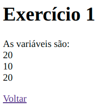

- Exercício 2:

Analisar os algoritmos e dizer o que será impresso na tela ao serem executados.

  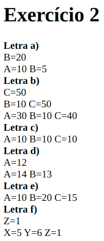

- Exercício 3:

Escolher uma data e verificar se o ano é bissexto.

  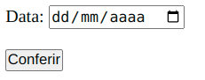

- Exercício 5:

Escrever um algoritmo para ler um valor e escrever (na tela) o seu antecessor.

  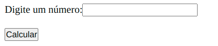

- Exercício 6:

Escrever um algoritmo para ler as dimensões de um retângulo (base e altura), calcular e mostrar a
área do retângulo. 

  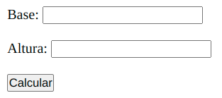

- Exercício 7:

Escrever um algoritmo para ler a idade de uma pessoa em dias.

  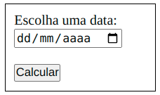

- Exercício 8:

Escrever um algoritmo para ler o número total de eleitores de um município, o número de votos
brancos, nulos e válidos. Calcular e escrever o percentual que cada um representa em relação ao total
de eleitores. 

  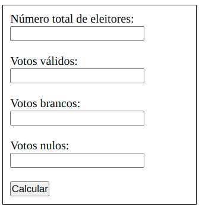

- Exercício 9:

Escrever um algoritmo para ler o salário mensal atual de um funcionário e o percentual de reajuste.
Calcular e escrever o valor do novo salário. 

  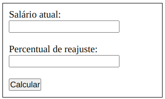

- Exercício 10:

O custo de um carro novo ao consumidor é a soma do custo de fábrica com a porcentagem do
distribuidor e dos impostos (aplicados ao custo de fábrica). Supondo que o percentual do distribuidor
seja de 28% e os impostos de 45%, escrever um algoritmo para ler o custo de fábrica de um carro,
calcular e escrever o custo final ao consumidor.  

  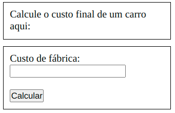

- Exercício 11:

Uma revendedora de carros usados paga a seus funcionários vendedores um salário fixo por mês,
mais uma comissão também fixa para cada carro vendido e mais 5% do valor das vendas por ele
efetuadas. Escrever um algoritmo que leia o número de carros por ele vendidos, o valor total de suas
vendas, o salário fixo e o valor que ele recebe por carro vendido. Calcule e escreva o salário final do
vendedor.   

  

- Exercício 12:

Escrever um algoritmo para ler uma temperatura em graus Fahrenheit, calcular e escrever o valor
correspondente em graus Celsius.   

  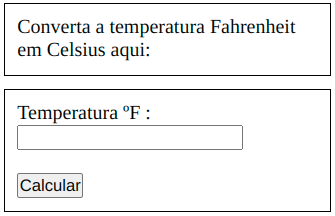

- Exercício 13:

Escrever um algoritmo para ler três notas de um aluno, calcular e escrever a média final deste aluno.
Considerar que a média é ponderada e que o peso das notas é 2, 3 e 5.   

  

- Exercício 14:

Ler um valor e escrever a mensagem É MAIOR QUE 10! se o valor lido for maior que 10, caso
contrário escrever NÃO É MAIOR QUE 10!    

  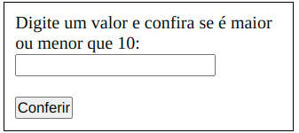

- Exercício 15:

Ler um valor e escrever se é positivo ou negativo.    

  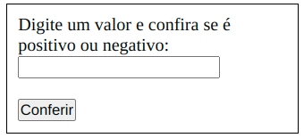

- Exercício 16:

As maçãs custam R$ 1,30 cada se forem compradas menos de uma dúzia, e R$ 1,00 se forem
compradas pelo menos 12. Escreva um programa que leia o número de maçãs compradas, calcule e
escreva o custo total da compra.

  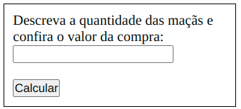

- Exercício 17:

Ler as notas da 1a. e 2a. avaliações de um aluno. Calcular a média aritmética simples e escrever
uma mensagem que diga se o aluno foi ou não aprovado (considerar que nota igual ou maior que 6 o
aluno é aprovado). Escrever também a média calculada. 

  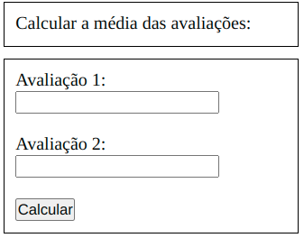

- Exercício 18:

Ler o ano atual e o ano de nascimento de uma pessoa. Escrever uma mensagem que diga se ela
poderá ou não votar este ano.  

  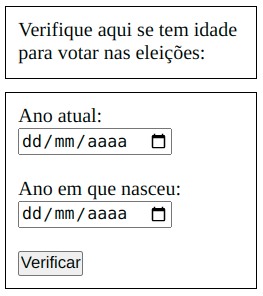

- Exercício 19:

Ler dois valores (considere que não serão lidos valores iguais) e escrever o maior deles.  

  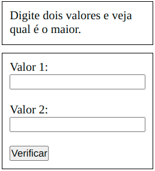

- Exercício 20:

Ler dois valores (considere que não serão lidos valores iguais) e escrevê-los em ordem crescente.

  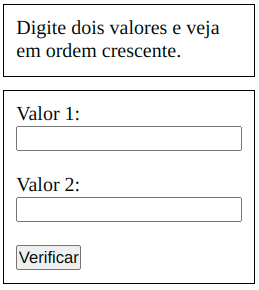

## 🚀 Como Rodar

- Clone o projeto.
- Entre no repositório e clice duas vezes no arquivo index.html

## 🤔 Como contribuir

- Faça um fork desse repositório;
- Cria uma branch com a sua feature: `git checkout -b minha-feature`;
- Faça commit das suas alterações: `git commit -m 'feat: Minha nova feature'`;
- Faça push para a sua branch: `git push origin minha-feature`.

Depois que o merge da sua pull request for feito, você pode deletar a sua branch.

## 📝 Licença

Esse projeto está sob a licença MIT.